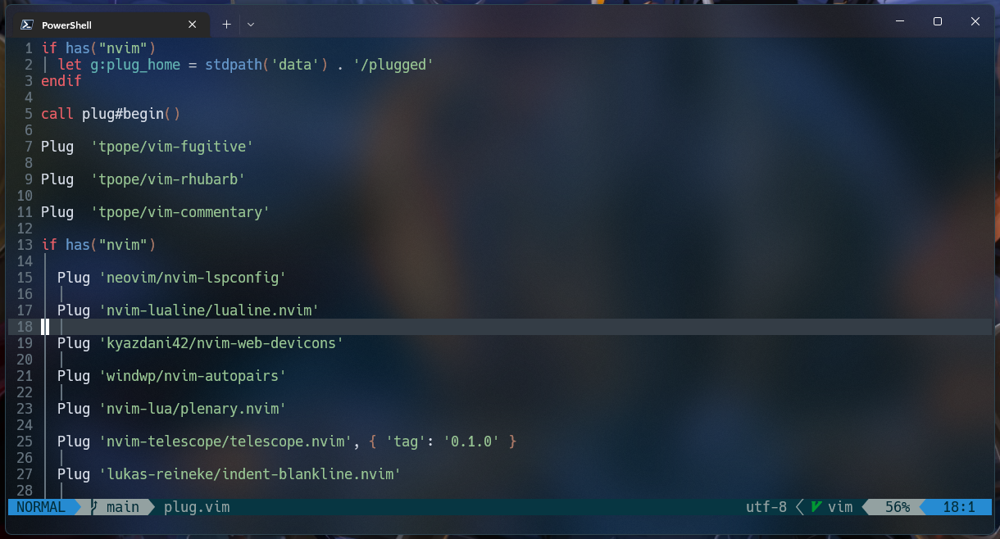
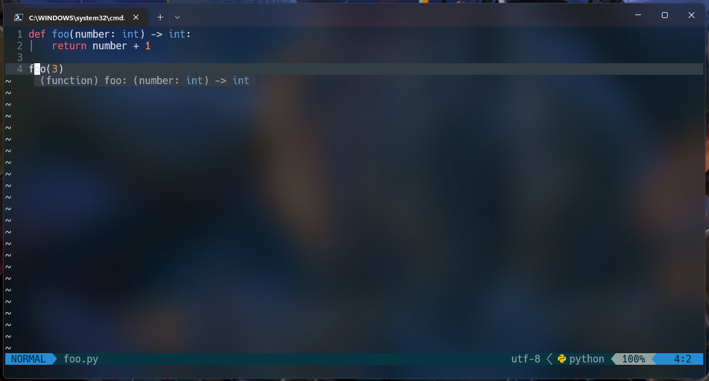
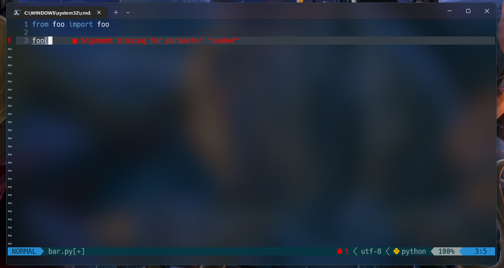
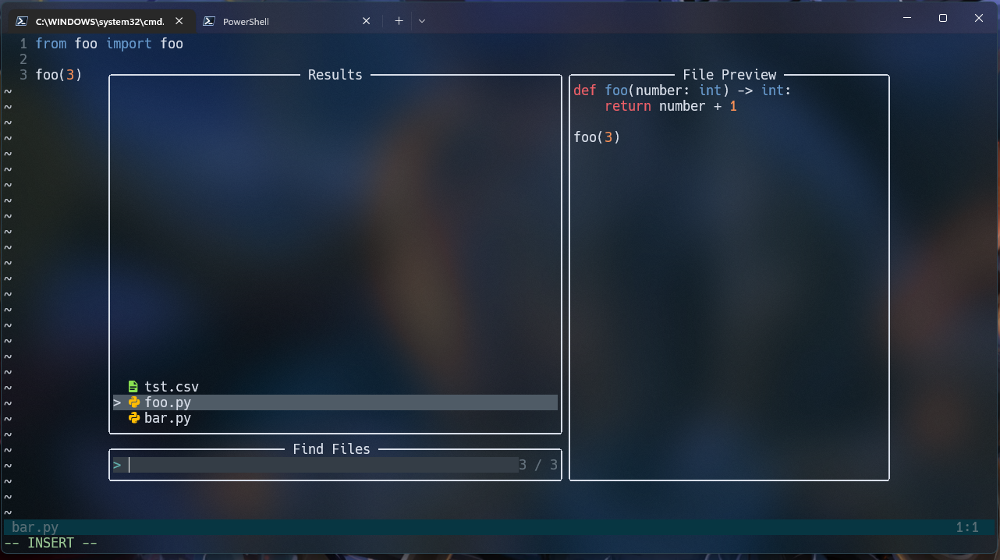

# Pictures 

Neovim in windows using Lua.

Huge thanks to:

* [Devaslife](https://github.com/craftzdog)

## Contents

* vim (NeoVim) config
  * Plugins are managed with [vim-plug](https://github.com/junegunn/vim-plug)
    * nvim-lspconfig - A collection of configurations for Neovim's built-in LSP
    * telescope.nvim - A highly extendable fuzzy finder over lists
    * nvim-Autopair - [],{},()
    * nvim-treesitter - Treesitter configurations and abstraction layer for Neovim 
    * ident-blankline.nvim - Identention on Neovim.

